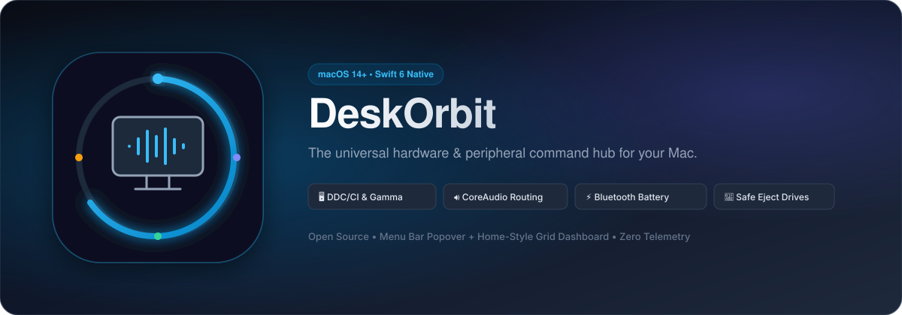

<p align="center">
  
</p>

<p align="center">
  <a href="https://neeraj15022001.github.io/DeskOrbit/"></a>
  <a href="https://developer.apple.com/macos/"></a>
  <a href="https://swift.org"></a>
  <a href="LICENSE"></a>
  <a href="#open-source--ai-provenance"></a>
</p>

---

## Overview

**DeskOrbit** is an open-source, native macOS hardware hub and peripheral controller designed for modern desks. Just like smart-home control centers unite your lights and appliances, DeskOrbit unifies all external and connected devices—displays, audio interfaces, Bluetooth accessories, and external storage—into a single, responsive macOS experience.

It lives unobtrusively in your **Menu Bar** for rapid glance-and-adjust controls, and expands into a full **Home-Style Dashboard** window whenever you want deeper control.

---

## Key Features

### 🖥️ Display Brightness & Contrast
- **Native Apple Displays:** Controls backlight natively on MacBook screens, Apple Studio Displays, and Pro Display XDR via `DisplayServices`.
- **Apple Silicon DDC/CI (`IOAVService`):** Communicates directly with external monitor microcontrollers over I²C (`0x37`) using VCP opcode `0x10` (as popularized by [MonitorControl](https://github.com/MonitorControl/MonitorControl) and [BetterDisplay](https://github.com/waydabber/BetterDisplay)).
- **GPU Gamma Table Manipulation:** Scales the GPU's color lookup tables (LUT) linearly via `CGSetDisplayTransferByTable` and `CGSetDisplayTransferByFormula` for external screens lacking DDC communication.
- **Software Dimming Overlay:** High-level `.screenSaver` click-through window shading across all virtual spaces and full-screen apps.

### 🔊 Audio Routing & Volume
- **Hardware Integration:** Powered by `CoreAudio` HAL hardware services with real-time property listeners (`AudioObjectAddPropertyListenerBlock`).
- **Volume & Mute:** Real-time volume scalar control and instant muting.
- **Fast Output Switching:** Switch your system's default audio output among internal speakers, headphones, USB DACs, and Bluetooth audio directly from the popover.

### ⚡ Bluetooth & Peripherals
- **Device Registry:** Powered by `IOBluetooth` to list all paired and active accessories.
- **Battery Indicators:** Live battery level percentages extracted from IOKit power sources (`IOPSCopyPowerSourcesInfo`) for supported headphones, mice, and keyboards.
- **Connection Toggling:** Connect or disconnect wireless peripherals in one click.

### 💾 External Storage Management
- **Drive Monitoring:** Lists mounted external drives, SD cards, and USB thumb drives with capacity utilization progress bars.
- **Safe Ejection:** Clean unmounting and device ejection powered by `DiskArbitration` and `NSWorkspace`.

### 🎛️ Dual-Mode Architecture (Menu Bar + Dashboard)
- **Accessory App (`LSUIElement = true`):** Runs cleanly in the menu bar without cluttering your macOS Dock or App Switcher.
- **Dynamic Activation Policy:** Seamlessly elevates to a standard `.regular` application when the full dashboard window is opened, bringing standard window management, focus, and tiling behaviors.

---

## Architecture & Subsystems

```
DeskOrbit/
├── Package.swift                    # Swift Package manifest targeting macOS 14+
├── Info.plist                       # Bundle configuration & permissions
├── bundle_app.sh                    # Automated release build and packaging script
├── assets/                          # Artwork, vectors, and banners
└── Sources/
    └── DevicesControl/
        ├── main.swift               # Application entry point
        ├── App/
        │   └── AppDelegate.swift    # Status item, popover, and NSWindow lifecycle
        ├── Models/
        │   └── DeviceModels.swift   # Strongly-typed device models
        ├── Services/
        │   ├── AudioService.swift   # CoreAudio hardware bindings & listeners
        │   ├── DisplayService.swift # DDC/CI (IOAVService), Gamma LUT, DisplayServices
        │   ├── BluetoothService.swift # IOBluetooth & IOKit power source battery monitor
        │   ├── StorageService.swift # DiskArbitration & NSWorkspace volume manager
        │   └── DeviceManager.swift  # Unified coordinator and reactive state manager
        └── Views/
            ├── MenuBarView.swift    # Compact popover interface
            ├── DashboardView.swift  # Modular home-style grid dashboard
            └── Components/          # Reusable cards and custom slider controls
```

---

## Quick Start & Installation

### Option 1: Run the Prebuilt App Bundle
Double-click `DeskOrbit.app` inside the repository:
```bash
open DeskOrbit.app
```

### Option 2: Build From Source
You only need macOS Command Line Tools or Xcode:
```bash
git clone https://github.com/<your-username>/DeskOrbit.git
cd DeskOrbit
swift build
swift run
```

### Option 3: Package Standalone `.app`
To generate an optimized release `.app` bundle:
```bash
./bundle_app.sh
open DeskOrbit.app
```

---

## Open Source & AI Provenance

DeskOrbit was conceptualized, architected, and implemented through **human-AI collaborative engineering** with **Gemini Spark (Google DeepMind)**.

- **Human Leadership:** Conceptual design, feature specifications, physical hardware verification (monitors, audio interfaces, and external drives), and system architecture guidance.
- **AI Co-Creation:** Real-time Swift/AppKit development, CoreAudio property binding, DDC/CI reverse engineering inspection, and automated test passes.
- **Transparency Commitment:** All future contributors—whether writing code manually or pairing with AI assistants—are welcomed! Please review our [Contribution Guidelines](CONTRIBUTING.md) for testing expectations on physical Mac hardware.

---

## Community & Contributing

Contributions are welcome! Please read:
- [Contributing Guidelines](CONTRIBUTING.md)
- [Code of Conduct](CODE_OF_CONDUCT.md)
- [Security Policy](SECURITY.md)

---

## License

DeskOrbit is distributed under the **MIT License**. See [LICENSE](LICENSE) for details.
